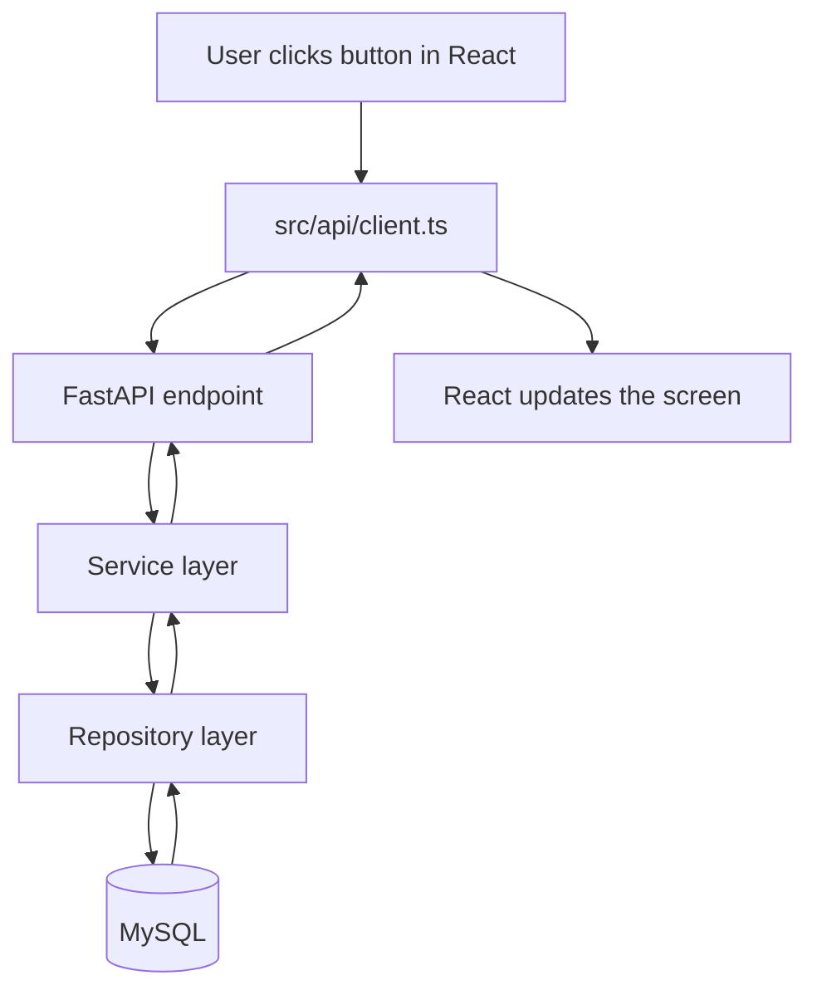

# Smart Wardrobe UI

## Frontend

This project is a minimal React + Vite + TypeScript frontend.

It is intentionally simple: no authentication, no Next.js, no Redux, no React Query, and no recommendation or outfit features yet. The goal is to make the frontend to API to database flow easy to understand.

Run it with:

```bash
npm install
npm run dev
```

The frontend reads the API base URL from `VITE_API_BASE_URL`. If it is not set, it uses `http://localhost:8000`.

Example `.env` file in the project root:

```env
VITE_API_BASE_URL=http://localhost:8000
```

You can copy `.env.example` as a starting point for local development.

### Identity flow

When the app opens without an active identity, it shows two options:

1. Create a new identity with `display_name`, `home_city`, and `home_country`.
2. Use an existing identity by pasting its `public_id`.

Creating an identity calls `POST /identities`. If the API returns a `public_id`, the app stores it in `localStorage` and opens the wardrobe screen.

Using an existing identity calls `GET /identities/{public_id}` first. If the API finds it, the app stores that `public_id` in `localStorage` and opens the wardrobe screen.

The `public_id` is not real authentication. It is only the active demo/development identity used by this frontend to read and write wardrobe data. There is no login, password, JWT, or session handling in this app.


