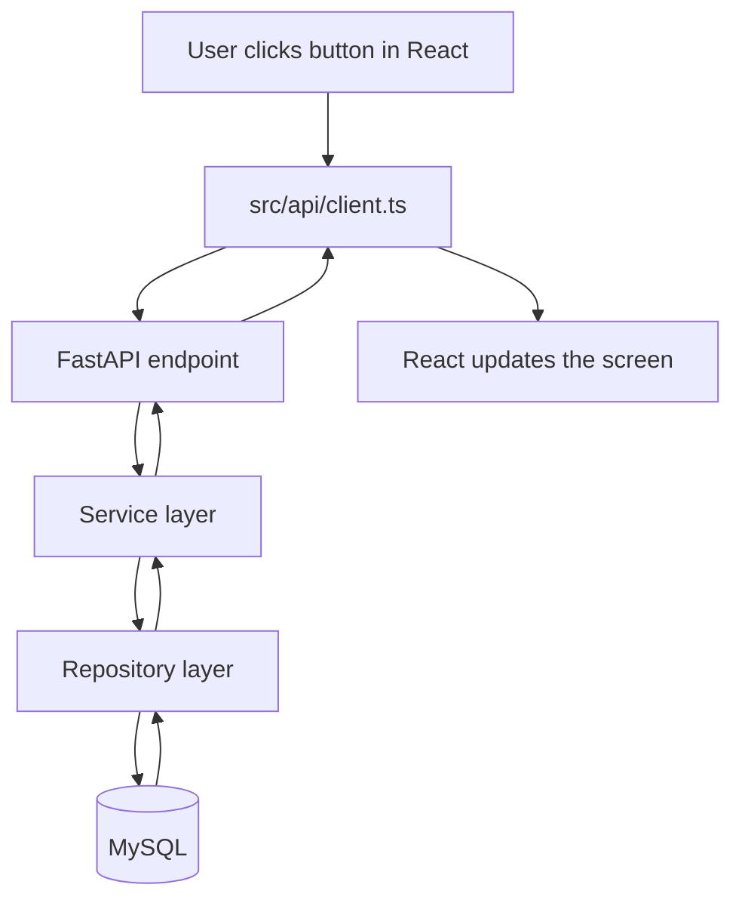

# Smart Wardrobe UI

## Frontend

This project is a minimal React + Vite + TypeScript frontend.

It is intentionally simple: no authentication, no Next.js, no Redux, no React Query, and no recommendation or outfit features yet. The goal is to make the frontend to API to database flow easy to understand.

Run it with:

```bash
npm install
npm run dev
```

The frontend reads the API base URL from `VITE_API_BASE_URL`. If it is not set, it uses `http://localhost:8000`.

Example `.env` file in the project root:

```env
VITE_API_BASE_URL=http://localhost:8000
```


